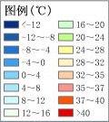
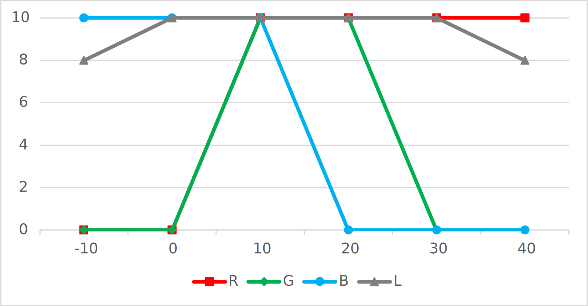

# ♪

一个小程序，在插件中用于根据气温改变字体的颜色

## 思路

以中央气象台的气温实况图中的图例为参考：



首先确定几个关键颜色：蓝色、白色、黄色、红色

但是不同的地方温度变化有一定的差距，所以关键气温自己定为：$0$，$10$，$20$，$30$

而超出范围的部分只需要改变亮度即可

因此可以制得下表：

|   ℃   |  R   |  G   |  B   |  L   |
| :---: | :--: | :--: | :--: | :--: |
| $-10$ | $0$  | $0$  | $10$ | $8$  |
|  $0$  | $0$  | $0$  | $10$ | $10$ |
| $10$  | $10$ | $10$ | $10$ | $10$ |
| $20$  | $10$ | $10$ | $0$  | $10$ |
| $30$  | $10$ | $0$  | $0$  | $10$ |
| $40$  | $10$ | $0$  | $0$  | $8$  |



根据以上图片写出对应函数计算各属性的值

[计算属性](demo.html ':include :type=code javascript :fragment=demo1')

再使用封装好的API生成颜色即可（这里使用的color-js对颜色进行操作）

[颜色生成](demo.html ':include :type=code javascript :fragment=demo2')

## 显示结果

[demo](demo.html ':include')

## 说明

该案例中将整个过程整合到了页面中，实际使用中只需要顺着思路编写对应的代码

比如在kwgt中使用时，是这样的：

```javascript
ce(
    cm(
        wi(temp) * 25.5,
        (15 - mu(abs, 15 - wi(temp))) * 25.5,
        (20 - wi(temp)) * 25.5
    ),
    #000000,
    (13 - mu(abs, 15 - wi(temp)) / 5) * 10
)
```

