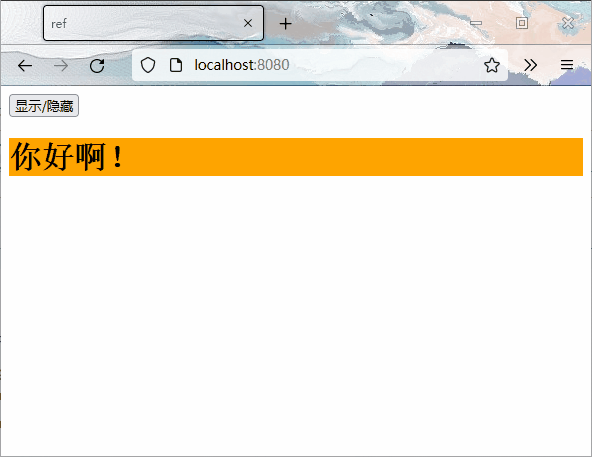

# Vue组件

## 非单文件组件

### 创建组件

```javascript
const varName = Vue.extend({
    template: `
        ...
    `
    data(){
        return {
            ...
        }
    },
    ...
})
```

>   创建组件时不写`el`段，因为最终所有组件都会被一个`vm`管理，由`vm`决定组件为哪个容器服务
>
>   组件使用`template`管理模板
>
>   如果写了`name`字段，则开发者工具里面显示的名称将和`name`字段对应

### 注册组件

#### 局部

```javascript
new Vue({
    el: '#root',
    components: {
        comName: varName
    }
})
```

#### 全局

```typescript
Vue.component(comName: string, varName: object)
```

---

>   如果在创建组件时，没有调用`Vue.extend`，而是直接声明一个对象，那么在这一步会自动调用`Vue.extend`

### 使用组件

```html
<div id="root">
    ...
    <comName></comName>
    <comName/>
    ...
</div>
```

>   一个组件可以被使用多次，并且即使是相同的组件，它们之间的数据也不会互相干扰
>
>   组件名是多个单词时：
>
>   1.   可以使用短横线`-`连接单词
>   2.   可以使用大驼峰`ComName`的形式，但是这种形式需要Vue脚手架的支持
>
>   如果使用单标签，在没有脚手架的情况下单个组件只能被使用一次

---

>   组件的本质其实是一个`VueComponent`构造函数，且并不是由程序员定义的，是由`Vue.extend`生成的
>
>   使用组件时，Vue解析时会帮我们创建对应组件的实例对象，即帮我们执行`new VueComponent(options)`
>
>   每次调用`Vue.extend`返回的都是一个全新的`VueComponent`
>
>   >   **关于this**
>   >
>   >   关于对象中`data`函数、`methods`中的函数、`watch`中的函数、`computed`中的函数中的`this`：
>   >
>   >   -   在组件配置中：`this`指向的是`VueComponent`实例对象
>   >   -   在`new Vue({})`中：`this`指向的是Vue实例对象

## Vue中的配置项

### ref

该标签的作用是替代`id`属性，如果在vue组件中需要使用`id`获取dom元素时，应避免使用`document.getElement`，而是使用`this.$refs.id`取代

```vue
<template>
  <div>
    <h1 v-text="msg" ref="title"></h1>
    <button @click="showDOM">点我输出上方的dom元素</button>
    <Child ref="child"/>
  </div>
</template>

<script>
import School from './components/Child.vue'
export default {
  name: 'App',
  components: {Child},
  data() {
    return {
      msg: 'welcome vue'
    }
  },
  methods: {
    showDOM() {
      console.log(this.$refs.title);
    }
  },
}
</script>

<style>

</style>
```


>   如果该属性用在了组件标签上，那么获取到的将不是dom元素，而是对应组件的vc

### props

该配置项的作用是从父组件接收值

```vue
<!-- Parent.vue -->
<template>
  <Child prop1="value1" prop2="value2"/>
</template>
```

```vue
<!-- Child.vue -->
<template>
  <div>
    {{prop1}}
    {{prop2}}
  </div>
</template>

<script>
export default {
  name: 'App',
  // (1) 简单声明接收
  // props: ['name', 'sex', 'age']
  
  // (2) 接收的同时对类型进行限制
  // props: {
  //   name: String,
  //   sex: String,
  //   age: Number
  // }

  // (3) 加上默认值的指定和必要性的限制
  // props: {
  //   name: {
  //     type: String, // 类型是字符串
  //     required: true // 该属性是必要的
  //   },
  //   age: {
  //     type: Number, // 类型是数字
  //     default: 999 // 默认值999
  //   },
  //   sex: {
  //     type: String,
  //     required: true,
  //   }
  // }
}
</script>
```

>   接收的值是**==不可更改的==**，vue底层会监测对`props`的修改，如果进行修改就会发出警告，若业务需求确实需要修改，只能复制`props`的内容到`data`中一份，然后去修改`data`中的数据
>
>   字段重复时，接收的值的优先级要大于定义的值
>
>   `props`中的东西是被优先接收的，所以可以在`data`和`methods`中使用`props`中的内容，因为`data`中的数据在`props`之后配置

### mixin

所有的公共的配置项都可以写在混合中，之后只需要引入即可使用混合的内容

>   混合的内容如果有重复项，则使用配置的值，丢弃混合的值
>
>   但是生命周期的钩子**不以任何一方为主，==两者都会被调用==**

#### 局部混合

```javascript
// mixin.js

export const mixin = {
    data() {
        return ...
    }
    methods: {
        methodName(): {
            ...
        }
    },
    mounted() {
        ...
    }
}
```

```vue
<!-- App.vue -->

<template>
  <div @click="methodName">
  </div>
</template>

<script>
import {mixin, ...} from '.../mixin'
export default {
  name: 'App',
  mixins: [mixin]
}
</script>
```

#### 全局混合

```javascript
// mixin.js

export const mixin1 = {
    ...
}

export const mixin2 = {
    ...
}
```

```javascript
// main.js

import {mixin1, mixin2} from './mixin'

Vue.mixin(mixin1)
Vue.mixin(mixin2)
```

## 插件

```javascript
// plugins.js
export default {
    install(Vue) {
        Vue.mixin({
            data() {
                return {
                    name: 'plugin name'
                }
            }
        })
        ...
    }
}
```

```javascript
import plugins from './plugins'

Vue.use(plugins)
```

插件用于对Vue进行增强

>   `install`的第一个参数`Vue`是Vue的构造器
>
>   调用时传入的参数都将依次放在`Vue`之后

---

>   在编写样式时，切记所有的样式最终会汇总在一起，所以可能会引发样式冲突，而后引入的样式会覆盖之前引入的样式
>
>   如果希望避免冲突，可以在`style`标签中加上`scoped`（`<style scoped></style>`），这样每个组件的样式只在每个组件中生效
>
>   原理是每个组件的标签中都会有一个随机生成的序列号（`data-v-xxxxxxxx`），然后使用标签的属性选择器即可控制指定组件中的内容
>
>   **`App`组件一般只添加全局样式**
>
>   `style`标签中还可以使用`lang`来指定编写样式的语言（css、less等）

## 组件的自定义事件

```vue
<template>
	<div>
        ...
        <ComponentName @EventName='MethodName'/>
        ...
    </div>
</template>

<script>
    export default {
        ...
        methods: {
            MethodName() {
                ...
            }
        }
        ...
    }
</script>
```

>   在组件上绑定的事件，默认都是自定义事件，包括`@click`等原生事件
>
>   如果想绑定真正的原生事件，需要以`@click.native`的形式绑定

如果使用`this.$refs.xxx.$on('eventName': string, methodName: function)`时，回调函数要么配置在`methods`中，要么用<u>**箭头函数**</u>，否则`this`的指向会有问题

## 全局事件总线

>   任意组件间通信

```javascript
// main.js
new Vue ({
  ...
  mounted() {
    Vue.prototype.$bus = this; // 安装全局事件总线
  }
  ...
})
```

>   最好在`beforeDestory`钩子中，用`$off`解绑**<u>当前组件</u>**所用到的事件

## 消息订阅与发布

>   [Vue中的消息订阅与发布（pubsub）\_李公子丶的博客-CSDN博客\_vue的pubsub](https://blog.csdn.net/qq_54527592/article/details/119539352 ':include')

## API

### $nextTick

```javascript
Vue.nextTick(()=>{
    ...
})
```

在下一次DOM更新结束后执行其指定的回调

一般在「需要改变数据后，要基于更新后的新DOM进行某些操作」时，要在`$nextTick`所指定的回调函数中执行

>   其实也可以写一个无回调时间的定时器，因为定时器会被推向队列，自然就会在「vue执行」之后执行了

>   [API — Vue.js](https://cn.vuejs.org/v2/api/#Vue-nextTick)

## Vue封装的过渡与动画

### 动画

```vue
<template>
    <div>
        <button @click="isShow = !isShow">显示/隐藏</button>
        <transition appear>
            <h1 v-show="isShow">你好啊！</h1>
        </transition>
        <transition name="igubigu" appear>
            <h1 v-show="!isShow">你好啊！</h1>
        </transition>
    </div>
</template>

<script>
export default {
    name: "Test",
    data() {
        return {
            isShow: true,
        }
    },
}
</script>

<style scoped>
h1 {
    background-color: orange;
}

.v-enter-active {
    animation: macabaca 1s ease-in-out;
}

.v-leave-active {
    animation: macabaca 1s ease-in-out reverse;
}

.igubigu-enter-active {
    animation: macabaca 1s ease-in-out;
}

.igubigu-leave-active {
    animation: macabaca 1s ease-in-out reverse;
}

@keyframes macabaca {
    from {
        transform: translateX(-100%);
    }
    to {
        transform: translateX(0);
    }
}
</style>
```


### 过渡

```vue
<template>
    <div>
        <button @click="isShow = !isShow">显示/隐藏</button>
        <transition-group name="igubigu">
            <h1 v-show="isShow" key="1">你好啊！</h1>
            <h1 v-show="!isShow" key="2">你好啊！</h1>
        </transition-group>
    </div>
</template>

<script>
export default {
    name: "Test2",
    data() {
        return {
            isShow: true,
        }
    },
}
</script>

<style scoped>
h1 {
    background-color: orange;
}

/* 进入的起点 */
.igubigu-enter,
/* 离开的终点 */
.igubigu-leave-to {
    transform: translateX(-100%);
}

/* 进入的终点 */
.igubigu-enter-to,
/* 离开的起点 */
.igubigu-leave {
    transform: translateX(0);
}

.igubigu-enter-active,
.igubigu-leave-active {
    transition: 1s ease-in-out;
}
</style>
```


>   如果有多个元素使用同一动画，则需要使用`transition-group`，同时**<u>将每个组件加上`key`</u>**

>   **使用外部库**
>
>   ```vue
>   <template>
>       <div>
>           <button @click="isShow = !isShow">显示/隐藏</button>
>           <transition-group name="animate__animated animate__bounce"
>                             enter-active-class="animate__swing"
>                             leave-active-class="animate__backOutUp"
>                             appear>
>               <h1 v-show="isShow" key="1">你好啊！</h1>
>               <h1 v-show="!isShow" key="2">你好啊！</h1>
>           </transition-group>
>       </div>
>   </template>
>   
>   <script>
>   import 'animate.css'
>   
>   export default {
>       name: "Test3",
>       data() {
>           return {
>               isShow: true,
>           }
>       },
>   }
>   </script>
>   
>   <style scoped>
>   h1 {
>       background-color: orange;
>   }
>   </style>
>   ```
>
>   

---

>   推荐阅读：[进入/离开 & 列表过渡 — Vue.js](https://cn.vuejs.org/v2/guide/transitions.html)

## ajax

### 跨域请求

#### 代理服务器

使用一个与自己同IP，同端口的服务器（`localhost:8080`），将请求发送给该服务器，则不会有同源问题，之后由于该服务器与目标服务器是**服务器——服务器**的通信，是通过`http`请求进行的，所以不会有同源要求

>   **注意**
>
>   同源问题发生时，请求成功发出，浏览器正常接收，但是**浏览器不会将接收到的数据给`js`程序**

##### 配置单个代理

```javascript
// vue.config.js
module.exports = defineConfig({
  devServer: {
    proxy: 'http://localhost:5000'
  }
})
```

>   解决问题「『连接中断』警告」：[记录载入页面时与 ws://XXX地址/sockjs-node/xxx/websocket 的连接中断---解决办法\_相与还的博客-CSDN博客](https://blog.csdn.net/xc9711/article/details/123144894)

>   如果`public`目录中已经存在了同名文件，则以`public`目录中的文件优先
>
>   所以单个代理无法实现更精准的控制

##### 配置多个代理

```javascript
// vue.config.js
module.exports = {
  devServer: {
    proxy: {
      '/api': {
        target: '<url>',
        pathRewrite: {'^/api': ''}, // 替换请求链接中的内容
        ws: true,
        changeOrigin: true // 用于控制请求头中的host字段
      },
      '/foo': {
        target: '<other_url>'
      }
    }
  }
}
```

---

推荐阅读：[配置参考 | Vue CLI](https://cli.vuejs.org/zh/config/#devserver-proxy)
